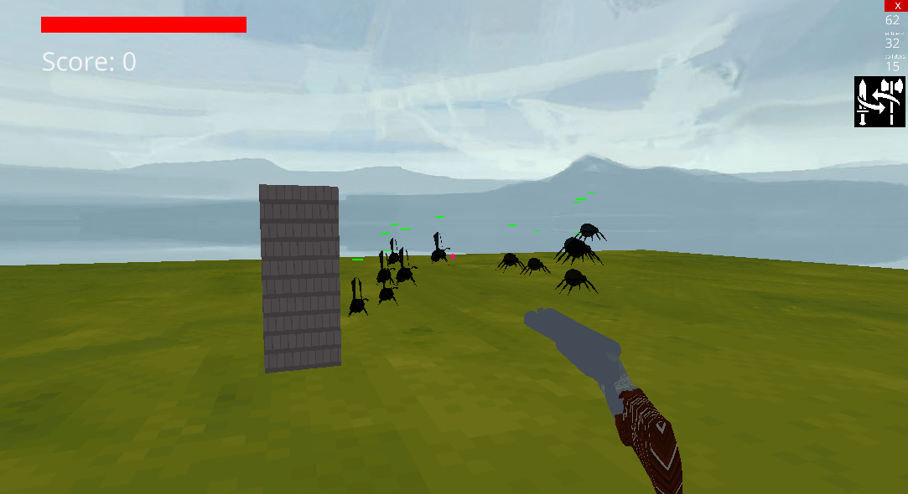
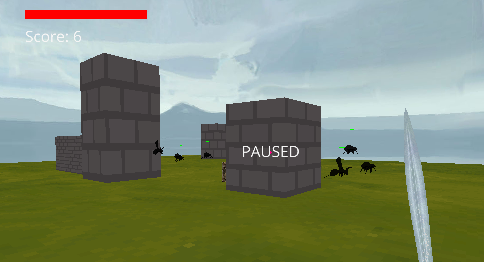

Python Ursina Project

Controls:\
Esc to pause\
Space to jump\
Left mouse click to attack/shoot\
z to change weapon\
x to randomly generate new scene\
Right mouse click to zoom/scope

{ width="590" }\
{ width="613" }\
{ width="525" }
